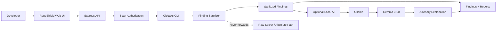
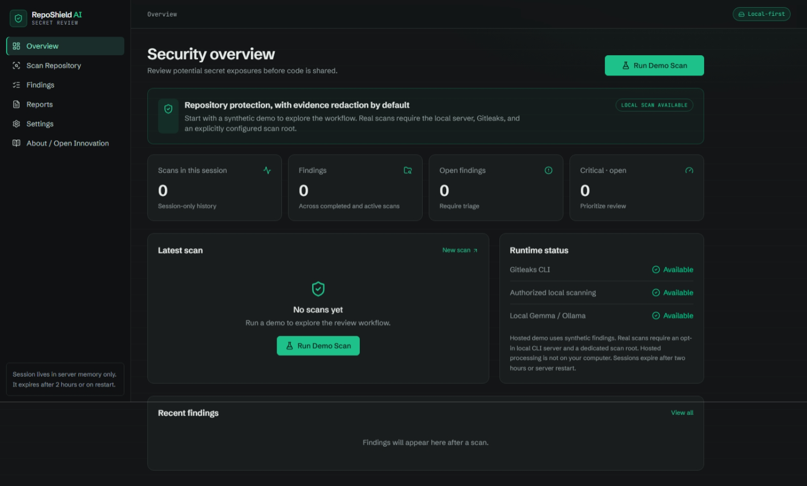
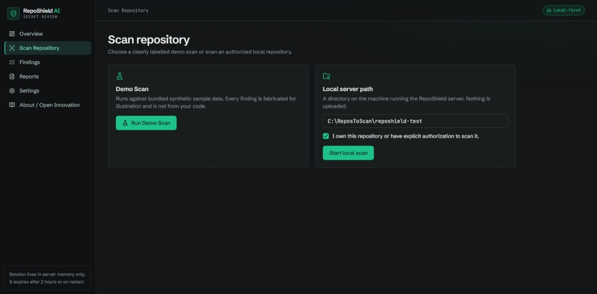
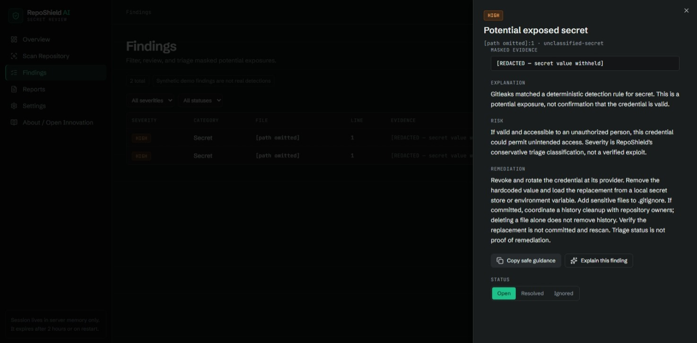
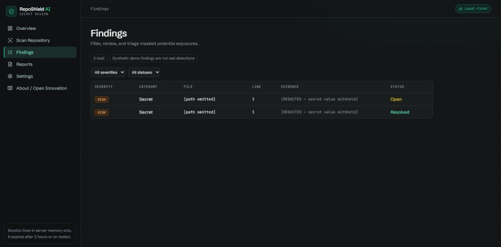

# RepoShield AI

**Local-first secret exposure review for repositories — deterministic detection, privacy-preserving triage, and optional local AI assistance.**

[](https://github.com/devanshshukla-3004/RepoShield-AI/actions/workflows/checks.yml)
[](https://nodejs.org/)
[](https://www.typescriptlang.org/)
[](https://react.dev/)
[](https://github.com/gitleaks/gitleaks)
[](https://ollama.com/)
[](LICENSE)

RepoShield AI helps developers review repositories for potential secret exposure **before code is shared**. It combines deterministic [Gitleaks](https://github.com/gitleaks/gitleaks) detection with a deliberately narrow privacy boundary and optional local [Ollama](https://ollama.com/) / `gemma3:1b` analysis.

The core design principle is simple:

> **Detect with deterministic security tooling. Explain locally. Never send raw secrets to the AI layer.**

---

## Why RepoShield?

Secret scanners are good at finding patterns. Developers still need to understand what a finding means, how serious it may be, and what to do next.

RepoShield separates those responsibilities:

1. **Gitleaks detects** potential secrets.
2. **RepoShield sanitizes** the result before it reaches the UI or report layer.
3. **Gemma can explain** the finding locally using only server-defined metadata.
4. **The developer triages and remediates** the exposure.

This keeps AI in an advisory role rather than allowing a language model to become the security detector.

---

## Core capabilities

| Capability | Implementation |
| --- | --- |
| Repository dashboard | React + TypeScript |
| Secret detection | Gitleaks CLI |
| Authorized local scanning | Dedicated scan root + explicit opt-in |
| AI explanations | Ollama + `gemma3:1b` |
| Privacy boundary | Secret/path redaction before UI/report/AI |
| Reports | Sanitized JSON + Markdown |
| Demo mode | Clearly labelled synthetic findings |
| Runtime visibility | Gitleaks, local scanning, and Ollama availability |
| Validation | Typecheck, unit tests, API build, frontend build |
| CI | GitHub Actions |

---

## Architecture



### AI security boundary

The AI prompt receives only server-defined finding metadata such as:

- finding type
- category
- severity
- rule identifier

It does **not** receive:

- raw secret values
- source code
- repository contents
- absolute repository paths
- raw Gitleaks evidence

If Ollama is unavailable, RepoShield falls back to deterministic guidance and clearly labels the fallback.

See the standalone diagram source: [`docs/architecture.mmd`](docs/architecture.mmd).

---

## Validated local workflow

The full local workflow has been tested with an authorized deterministic test repository:

```text
Repository
    │
    ▼
Gitleaks
    │
    ▼
1 HIGH finding
    │
    ├── secret value → withheld
    ├── absolute path → withheld
    │
    ▼
Sanitized finding
    │
    ▼
Ollama / Gemma 3 1B
    │
    ▼
Explanation + risk + remediation
    │
    ▼
Findings / Reports
```

The validated run reported **1 finding across 2 analyzed files**, completed successfully, and produced an AI-assisted explanation without exposing the test secret in the UI.

---

## Visual walkthrough

The portfolio demo is intentionally structured as a progression from the security overview to detection, investigation, and AI-assisted remediation.

### 1. Security overview



### 2. Local repository scan



### 3. Finding details



### 4. Local AI analysis



---

## Quick start — Windows

### Requirements

- Node.js 24
- Git
- pnpm 10
- Ollama
- Gitleaks

### Install dependencies

```powershell
pnpm install --frozen-lockfile
pnpm run typecheck
pnpm test
```

### Install the local AI model

```powershell
ollama pull gemma3:1b
ollama list
```

Verify inference:

```powershell
ollama run gemma3:1b
```

### Build

```powershell
$env:PORT = "3000"
$env:BASE_PATH = "/"

pnpm --filter @workspace/reposhield run build
pnpm --filter @workspace/api-server run build
```

### Configure authorized local scanning

Create a dedicated scan root:

```powershell
New-Item -ItemType Directory -Force C:\ReposToScan
```

Only place repositories you own or are explicitly authorized to inspect inside that directory.

Then start the API:

```powershell
$env:PORT = "3000"
$env:REPOSHIELD_LOCAL_SCAN = "1"
$env:REPOSHIELD_SCAN_ROOT = "C:\ReposToScan"

pnpm --filter @workspace/api-server run start
```

Open:

```text
http://127.0.0.1:3000
```

Go to **Settings & runtime**, confirm that **Local Gemma / Ollama** is available, enable local explanations, and then use **Scan Repository**.

---

## Quick start — Linux

Install Node.js 24, Git, pnpm 10, Ollama, and Gitleaks using their official installation instructions.

```bash
corepack enable
corepack prepare pnpm@10.8.1 --activate

ollama pull gemma3:1b

pnpm install --frozen-lockfile
pnpm run typecheck
pnpm test

PORT=3000 REPOSHIELD_LOCAL_SCAN=1 \
REPOSHIELD_SCAN_ROOT="$HOME/ReposToScan" \
pnpm --filter @workspace/api-server run start
```

Only scan repositories you own or have explicit permission to inspect.

---

## Test Ollama without scanning a repository

RepoShield includes a harmless Ollama smoke test:

```bash
node scripts/check-ollama.mjs
```

This checks the loopback Ollama API and confirms that the configured model can return a completed response. It does not inspect repository contents.

---

## Security model

RepoShield is designed around explicit boundaries rather than implicit trust.

### 1. Local scanning is opt-in

Real repository scans require:

```text
REPOSHIELD_LOCAL_SCAN=1
REPOSHIELD_SCAN_ROOT=<dedicated-authorized-root>
```

### 2. Scan scope is constrained

The scanner validates that the requested repository stays inside the configured scan root.

### 3. Evidence is sanitized

Raw secret values are withheld from findings and reports. Absolute filesystem paths are also withheld.

### 4. AI is advisory

A model response is not a detection, proof of credential validity, or proof of remediation.

### 5. Local inference stays local

Ollama is accessed through the loopback interface:

```text
http://127.0.0.1:11434
```

No hosted LLM API is required for the AI explanation workflow.

### 6. History scanning is out of scope

The current implementation scans the authorized working tree. It does not perform a complete Git-history secret audit.

---

## Demo mode vs. real scans

RepoShield deliberately distinguishes synthetic demos from real detections.

### Demo mode

- Uses fabricated findings.
- Safe to demonstrate publicly.
- Does not imply that a real credential was found.

### Real local mode

- Uses Gitleaks against an explicitly authorized local repository.
- Requires the local scan feature and scan root to be configured.
- Should remain a local/developer workflow rather than an exposed public filesystem scanner.

---

## Reports

Completed scans can produce sanitized:

- JSON reports
- Markdown reports

Reports are designed for review and sharing without leaking raw secret values or absolute local paths.

---

## Engineering validation

The recovered full-stack application was validated locally with:

```text
TypeScript typecheck        ✓
Unit tests                  ✓ 4/4
API production build        ✓
React/Vite production build ✓
Gitleaks local scan         ✓
Ollama / Gemma inference    ✓
AI-assisted finding         ✓
```

The test suite covers path safety, scan-root containment, finding sanitization, and the synthetic/demo boundary.

---

## Known limitations

RepoShield AI is a portfolio and learning project, not a replacement for a professional security audit.

- Secret detection can produce false positives and false negatives.
- A detected pattern does not prove that a credential is valid.
- The current real-scan workflow targets the working tree rather than complete Git history.
- Local AI explanations can be incomplete or incorrect.
- Deleting a file does not revoke a credential or remove it from Git history.
- Any exposed credential should be revoked/rotated at its provider.
- Only scan repositories you own or have explicit permission to inspect.

---

## Project structure

```text
RepoShield-AI/
├── artifacts/
│   ├── api-server/       # Express API + scanner integration
│   └── reposhield/       # React dashboard
├── scripts/              # validation and smoke-test utilities
├── docs/
│   ├── architecture.mmd  # system architecture diagram
│   └── media/            # portfolio screenshots / demo GIF
├── .github/
│   └── workflows/        # CI
├── package.json
├── pnpm-workspace.yaml
└── README.md
```

---
---

## License

MIT
